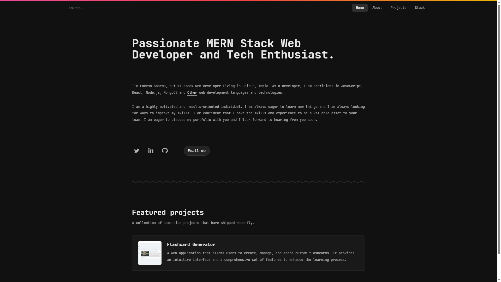

# Personal Portfolio Website

  

Welcome to my personal portfolio website built with Next.js, Tailwind CSS, and other technologies. You can view the live website here: [https://lokeshkavisth.vercel.app/](https://lokeshkavisth.vercel.app/)



## Table of Contents

- [Overview](#overview)
- [Technologies Used](#technologies-used)
- [Getting Started](#getting-started)
- [Color Palette](#color-palette)
- [License](#license)

## Overview

This project is my personal portfolio website, where I showcase my skills, projects, and other information about myself. It is designed to provide an interactive and visually appealing platform for visitors to learn more about me and my work.

## Technologies Used

- [Next.js](https://nextjs.org/): A React framework for building server-rendered React applications.

- [Tailwind CSS](https://tailwindcss.com/): A utility-first CSS framework for rapidly building custom designs.

- [npm](https://www.npmjs.com/): The package manager for JavaScript.

- [react-icons](https://react-icons.github.io/react-icons/): A library of customizable icons for React applications.

## Getting Started

To get a copy of this project up and running on your local machine, follow these steps:

1. Clone the repository:

   ```bash
   git clone https://github.com/lokeshkavisth/portfolio-v2.git
   ```

2. Navigate to the project directory:

   ```bash
   cd portfolio-v2
   ```

3. Install the project dependencies:

   ```bash
   npm install
   ```

4. Start the development server:

   ```bash
   npm run dev
   ```

5. Open your browser and visit [http://localhost:3000](http://localhost:3000) to see the website in action.

## Color Palette

Here's the color palette used in this project:

| Color Name | Hex Code |
| ---------- | -------- |
| black_01   | #111111  |
| white_01   | #eaeaea  |
| black_02   | #2e2e2e  |
| white_02   | #b1b1b1  |
| black_03   | #191919  |
| white_03   | #f6f6f6  |
| black_04   | #242424  |
| black_05   | #363636  |

Feel free to use these colors to maintain a consistent visual identity across your website.

## License

This project is licensed under the MIT License - see the [LICENSE](LICENSE) file for details.

Thank you for checking out my personal portfolio website project! If you have any questions or feedback, feel free to [contact me](https://twitter.com/lokeshkavisth).
